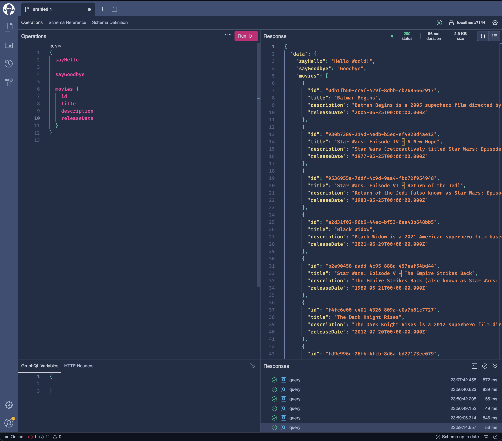

# aspnet-core-movie-minimal-web-api-hotchocolate-graphql

ASP.NET Core Movie Minimal Web API using Hot Chocolate GraphQL

Find more details about .NET Core CLI for EF Tools in https://learn.microsoft.com/en-us/ef/core/cli/dotnet

Find more details about Migration in https://learn.microsoft.com/en-us/ef/core/managing-schemas/migrations/?tabs=dotnet-core-cli

# Installation

## To Install EF Tools

    dotnet tool install --global dotnet-ef

## To Update EF Tools

    dotnet tool update --global dotnet-ef

## To Verify EF Tools Installation

    dotnet ef

## To Use EF Tools in Project
It is already added in this project.

    dotnet add package Microsoft.EntityFrameworkCore.Design

# Database Container

## To Run SQL Server Container

    docker compose up sql_server_db

## To Run PostgreSQL Container

    docker compose up postgres_db

## To Run SQLite Container

    docker compose up postgres_db

# Database Migration

## Some EF Commands

| Command                            | Description                                              |
| ---------------------------------- | -------------------------------------------------------- |
| `dotnet ef migrations add [name]`  | Create a new migration with the specific migration name. |
| `dotnet ef migrations remove`      | Remove the latest migration.                             |
| `dotnet ef migrations list`        | Lists all available migrations.                          |
| `dotnet ef migrations script`      | Generates a SQL script for all migrations.               |
| `dotnet ef database update`        | Update the database to the latest migration.             |
| `dotnet ef database update [name]` | Update the database to a specific migration name point.  |
| `dotnet ef database drop`          | Drop the database.                                       |

## To Create First Database Migration
create separate migrations for any changes for each database. Before running any of the following migrations, 
update `UseDatabase` field with any of `DatabaseType` enum in terms of database in `appsettings.Development.json`.

For example, set as `"UseDatabase": "SQLServer"` and save `appsettings.Development.json` then run the first command below;

SQLServer

    dotnet ef migrations add InitialCreate --context SqlServerSuperheroDbContext -o Migrations/SqliteMigrations

SQLite

    dotnet ef migrations add InitialCreate --context SqliteSuperheroDbContext -o Migrations/SqliteMigrations

PostgreSQL

    dotnet ef migrations add InitialCreate --context PostgresSuperheroDbContext -o Migrations/PostgresMigrations

## To Create Database and Schema

SQLServer

    dotnet ef database update --context SqlServerSuperheroDbContext

SQLite

    dotnet ef database update --context SqliteSuperheroDbContext

PostgreSQL

    dotnet ef database update --context PostgresSuperheroDbContext

## To Remove Last Executed Database Migration

SQLServer

    dotnet ef migrations remove --context SqlServerSuperheroDbContext

SQLite

    dotnet ef migrations remove --context SqliteSuperheroDbContext

PostgreSQL

    dotnet ef migrations remove --context PostgresSuperheroDbContext

## To List Database Migrations

SQLServer

    dotnet ef migrations list --context SqlServerSuperheroDbContext

SQLite

    dotnet ef migrations list --context SqliteSuperheroDbContext

PostgreSQL

    dotnet ef migrations list --context PostgresSuperheroDbContext

## To Check Pending Model Changes
This feature was added in EF Core 8.0.

    dotnet ef migrations has-pending-model-changes

# Run Project

## To Build Project

    dotnet build

## To Run Project

    dotnet run

## To View Hot Chocolate GraphQL Web UI

port is assigned dynamically.

    http://localhost:[PORT]/graphql

